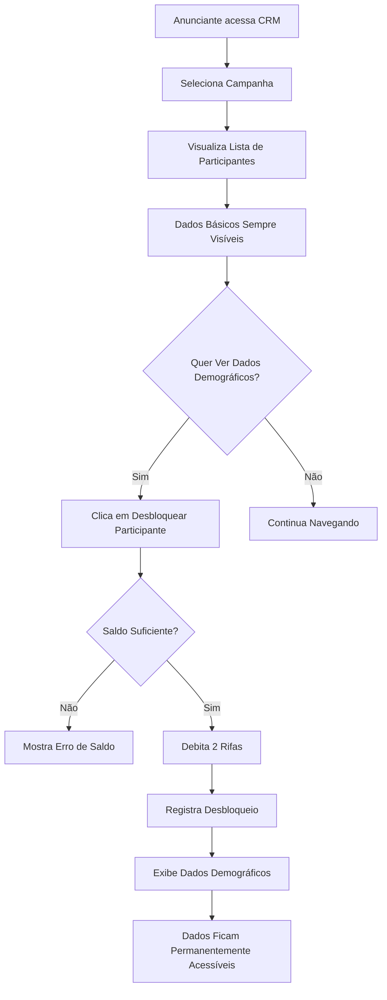

# Sistema de Desbloqueio por Participante - Implementação

## Visão Geral

Implementação completa da mudança do sistema de liberação de dados demográficos no CRM do anunciante, alterando de **cobrança por campanha** para **cobrança por participante individual**.

## Mudanças Principais

### Antes (Sistema Antigo)
- ✅ Anunciante pagava 2 rifas por campanha
- ✅ Desbloqueava TODOS os dados demográficos de TODOS os participantes da campanha
- ✅ Cobrança única por missão

### Depois (Sistema Novo)
- 🆕 Anunciante paga 2 rifas por participante individual
- 🆕 Desbloqueio granular - apenas do participante escolhido
- 🆕 Controle fino sobre gastos e acesso aos dados
- 🆕 Dados gerais da campanha sempre visíveis (estatísticas, engajamento)
- 🆕 Dados específicos (idade, gênero, localização) requerem desbloqueio individual

## Arquivos Modificados

### 1. Backend - Edge Function
**Arquivo:** `supabase/functions/unlock-crm-details/index.ts`
- Atualizada para processar desbloqueio por `participantId` + `missionId`
- Implementa verificação de saldo de rifas
- Registra transações e desbloqueios
- Evita cobrança duplicada para o mesmo participante

### 2. Hook Principal
**Arquivo:** `src/hooks/advertiser/useDesbloqueioParticipantes.ts`
- Novo hook `useDesbloqueioParticipante()` para controle individual
- Hook adicional `useDesbloqueiosParticipantes()` para visão geral
- Estado de carregamento e controle de erros

### 3. Componente de Tabela
**Arquivo:** `src/components/advertiser/dashboard/ParticipationTable.tsx`
- Interface completamente reformulada
- Cada participante tem seu próprio botão de desbloqueio
- Exibe saldo de rifas e custo em tempo real
- Estado visual diferenciado (bloqueado/desbloqueado)

### 4. Dashboard Principal
**Arquivo:** `src/components/advertiser/dashboard/CrmDashboard.tsx`
- Painel informativo sobre o novo sistema
- Integração com novos componentes
- Dados agregados sempre visíveis

### 5. Hook de Dados
**Arquivo:** `src/hooks/useAdvertiserCrm.ts`
- Tipos atualizados para incluir `id` do participante
- Interface de participante reformulada
- Dados demográficos específicos marcados como opcionais

### 6. Migração de Banco
**Arquivo:** `supabase/migrations/20250119000000_participant_unlock_system.sql`
- Nova tabela `advertiser_participant_unlocks`
- Função `unlock_participant_demographics()` 
- Função `check_participant_unlocked()`
- View `advertiser_unlocks_summary` para análises
- Políticas RLS para segurança

## Fluxo do Sistema

## Características Técnicas

### Segurança
- ✅ RLS habilitado na nova tabela
- ✅ Verificação de propriedade do anunciante
- ✅ Validação de saldo antes do débito
- ✅ Prevenção de cobrança duplicada

### Performance
- ✅ Índices otimizados para consultas frequentes
- ✅ Queries paralelas para dados básicos vs demográficos
- ✅ Cache nos hooks React Query

### UX/UI
- ✅ Feedback visual claro (bloqueado/desbloqueado)
- ✅ Informações de saldo em tempo real
- ✅ Botões desabilitados quando saldo insuficiente
- ✅ Painel informativo sobre o novo sistema

## Migração e Rollout

### Dados Existentes
- A migração é **não-destrutiva**
- Tabela antiga `advertiser_crm_unlocks` mantida para compatibilidade
- Sistema novo funciona independentemente

### Rollback
Se necessário, o rollback pode ser feito:
1. Revertendo a Edge Function para versão anterior
2. Usando hook antigo `useDesbloqueioParticipantes`
3. Tabela antiga permanece íntegra

## Testes Recomendados

### Cenários de Teste
1. **Desbloqueio com saldo suficiente**
2. **Tentativa com saldo insuficiente**
3. **Desbloqueio duplicado do mesmo participante**
4. **Navegação entre campanhas diferentes**
5. **Estados de loading e erro**

### Verificações
- [ ] Saldo de rifas atualiza corretamente
- [ ] Transações são registradas
- [ ] UI reflete estados corretos
- [ ] Performance mantida com muitos participantes
- [ ] Dados demográficos aparecem após desbloqueio

## Configuração do Valor

O custo por desbloqueio está definido como **2 rifas** e pode ser alterado em:
- Edge Function: variável `requiredRifas`
- Hook: variável `requiredRifas`  
- Migração SQL: default value na função

## Monitoramento

### Métricas Sugeridas
- Taxa de desbloqueio por participante
- Gasto médio de rifas por campanha
- Participantes mais desbloqueados
- Anunciantes com maior uso do sistema

### Logs
- Edge Function logga todas operações importantes
- Transações registradas na tabela `rifas_transactions`
- View `advertiser_unlocks_summary` facilita análises

---

## Resumo

✅ Sistema implementado e funcional  
✅ Migração segura e não-destrutiva  
✅ Interface intuitiva e responsiva  
✅ Performance otimizada  
✅ Logs e monitoramento incluídos  

O sistema agora oferece controle granular sobre os gastos com dados demográficos, permitindo que os anunciantes paguem apenas pelos dados que realmente precisam acessar. 