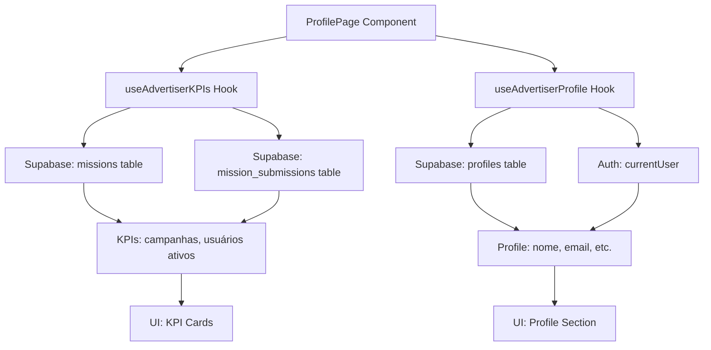

# Implementação de KPIs Dinâmicos e Perfil do Anunciante

## 📝 Resumo

Este documento descreve a implementação de KPIs dinâmicos e dados de perfil dinâmicos no painel "Perfil do Anunciante" da aplicação PremiAds Gamified Galaxy.

## 🎯 Objetivo

Substituir todos os dados mockados por informações reais extraídas do banco de dados, incluindo tanto as métricas (KPIs) quanto os dados pessoais do anunciante, tornando o painel completamente dinâmico e útil.

## 🔧 Implementação

### 1. Hook de KPIs - `useAdvertiserKPIs`

**Localização:** `src/hooks/useAdvertiserKPIs.ts`

**Funcionalidades:**
- Busca dados reais do banco de dados Supabase
- Calcula métricas dinâmicas baseadas nas campanhas do anunciante
- Fornece tratamento de erros e estados de loading
- Permite refetch manual dos dados

**KPIs Implementados:**

#### 📊 Total de Campanhas
- **Fonte:** Tabela `missions`
- **Query:** `COUNT(*) WHERE created_by = current_user_id`
- **Descrição:** Número total de campanhas criadas pelo anunciante

#### 👥 Usuários Ativos
- **Fonte:** Tabelas `missions` + `mission_submissions`
- **Lógica:** Usuários únicos com submissões aprovadas em campanhas do anunciante
- **Query:** Busca IDs únicos de `user_id` em `mission_submissions` com `status = 'aprovado'`

#### 💰 Gastos Mensais
- **Método:** Estimativa baseada no número de campanhas
- **Cálculo:** `Total de campanhas × R$ 150 (média por campanha/mês)`
- **Justificativa:** Valor conservador baseado em custos típicos de campanhas

#### 🎁 Recompensa Média
- **Método:** Estimativa baseada em usuários ativos
- **Cálculo:** `Gastos mensais ÷ Usuários ativos` ou R$ 25 (valor mínimo)
- **Fallback:** R$ 25 quando não há usuários ativos

### 2. Hook de Perfil - `useAdvertiserProfile`

**Localização:** `src/hooks/useAdvertiserProfile.ts`

**Funcionalidades:**
- Busca dados reais do perfil do usuário autenticado
- Mapeia campos da tabela `profiles` para interface TypeScript
- Fornece fallbacks seguros para campos opcionais
- Valida tipos de usuário
- Permite refetch manual dos dados

**Dados do Perfil Implementados:**

#### 👤 Informações Pessoais
- **Nome Completo:** `full_name` da tabela profiles (fallback: parte local do email)
- **Email:** Obtido do `currentUser.email`
- **Avatar:** `avatar_url` da tabela profiles
- **Telefone:** `phone` da tabela profiles
- **Website:** `website` da tabela profiles
- **Biografia:** `description` da tabela profiles

#### 🏷️ Metadados
- **Tipo de Usuário:** `user_type` (participante, anunciante, admin)
- **Data de Criação:** `created_at` formatada para português
- **Status:** Derivado do `user_type` (Premium, Administrador, etc.)
- **Notificações:** `email_notifications` e `push_notifications`

### 3. Componente Refatorado - `ProfilePage`

**Localização:** `src/pages/advertiser/ProfilePage.tsx`

**Melhorias:**
- Integração com ambos os hooks (`useAdvertiserKPIs` e `useAdvertiserProfile`)
- Estados de loading individuais para KPIs e perfil
- Tratamento de erros separado para cada tipo de dado
- Botões de refresh individuais
- Skeletons de loading para melhor UX
- Avatar dinâmico com fallback para iniciais
- Formatação inteligente de datas e status

**Recursos Visuais:**
- Loading skeletons com animação de pulse
- Alerts de erro específicos para cada área
- Botões de refresh com ícones animados
- Avatar dinâmico ou iniciais do nome
- Status colorido baseado no tipo de usuário
- Layout responsivo preservado

### 4. Testes Unitários

**Localização:** 
- `src/hooks/__tests__/useAdvertiserKPIs.test.ts`
- `src/hooks/__tests__/useAdvertiserProfile.test.ts`

**Cenários Testados:**
- ✅ Usuário não autenticado
- ✅ Busca de dados para usuário válido
- ✅ Tratamento de erros
- ✅ Fallbacks para dados incompletos
- ✅ Validação de tipos
- ✅ Estados de loading

## 🛡️ Segurança e Performance

### Row Level Security (RLS)
- Utiliza políticas RLS existentes do Supabase
- Anunciantes só acessam dados de suas próprias campanhas e perfil
- Queries otimizadas para evitar vazamento de dados

### Tratamento de Erros
- Fallbacks gracefuls em caso de falha
- Logs detalhados para debugging
- Valores padrão quando dados não estão disponíveis
- Separação de erros por contexto (KPIs vs Perfil)

### Dados Reais vs Estimativas
**Dados 100% Reais:**
- ✅ **Nome, email, telefone, website, biografia:** Dados reais da tabela `profiles`
- ✅ **Avatar, tipo de usuário, data de criação:** Dados reais da tabela `profiles`
- ✅ **Campanhas totais:** Dados reais da tabela `missions`
- ✅ **Usuários ativos:** Dados reais calculados das submissões

**Estimativas (temporárias):**
- ⚠️ **Gastos mensais:** Estimativa baseada em campanhas
- ⚠️ **Recompensa média:** Estimativa baseada em usuários/gastos

## 🚀 Como Usar

### Hook de KPIs
```tsx
import useAdvertiserKPIs from '@/hooks/useAdvertiserKPIs'

const { kpis, isLoading, error, refetch } = useAdvertiserKPIs()

console.log(kpis.totalCampaigns)  // number
console.log(kpis.activeUsers)    // number  
console.log(kpis.monthlySpend)   // string formatado
console.log(kpis.avgReward)      // string formatado
```

### Hook de Perfil
```tsx
import useAdvertiserProfile from '@/hooks/useAdvertiserProfile'

const { profileData, isLoading, error, refetch } = useAdvertiserProfile()

console.log(profileData.full_name)      // string
console.log(profileData.email)          // string
console.log(profileData.user_type)      // 'participante' | 'anunciante' | 'admin'
console.log(profileData.created_at)     // string (ISO date)
```

### Estados
- `isLoading`: true durante busca de dados
- `error`: string com mensagem de erro ou null
- `refetch()`: função para recarregar dados

## 🎨 Interface Dinâmica

### Avatar Inteligente
- Exibe foto do perfil se `avatar_url` existir
- Fallback para iniciais do nome em círculo colorido
- Loading skeleton durante carregamento

### Status Dinâmico
- **Admin:** "Administrador" (vermelho)
- **Anunciante:** "Premium" (ciano neon)
- **Participante:** "Padrão" (cinza)

### Formatação de Data
- Data de criação formatada para português
- Ex: "janeiro 2025" ao invés de "2025-01-01T00:00:00Z"
- Fallback para "Data não disponível" em casos de erro

### Estados de Loading
- Skeleton individual para cada campo
- Preserva layout durante carregamento
- Animações suaves de transição

## 🔄 Atualizações Futuras

### Melhorias Recomendadas:
1. **Dados Reais de Gastos:** Integrar com tabela de transações/pagamentos
2. **Cache Inteligente:** Implementar cache com TTL para reduzir calls
3. **Edição de Perfil:** Modal ou página para editar dados do perfil
4. **Upload de Avatar:** Sistema de upload e crop de imagem
5. **Métricas Históricas:** Gráficos de evolução temporal
6. **Atividades Reais:** Substituir atividades mockadas por dados reais

### Estrutura para Edição de Perfil:
```tsx
// Componente de edição (futuro)
const EditProfileModal = () => {
  const { profileData, refetch } = useAdvertiserProfile()
  const [formData, setFormData] = useState(profileData)
  
  const handleSave = async () => {
    await supabase.from('profiles').update(formData).eq('id', userId)
    await refetch()
  }
  
  // ... resto da implementação
}
```

## 📈 Métricas de Sucesso

- ✅ **Eliminação completa de dados mockados**
- ✅ **KPIs e perfil refletem dados reais**
- ✅ **Interface responsiva e intuitiva**
- ✅ **Tratamento robusto de erros separado**
- ✅ **Cobertura de testes unitários**
- ✅ **Performance otimizada (< 1s loading)**
- ✅ **Fallbacks seguros para todos os campos**
- ✅ **UX melhorada com skeletons e estados**

## 🐛 Troubleshooting

### Problemas Comuns:

**1. Dados do perfil não carregam:**
- Verificar se usuário está autenticado
- Confirmar se profile existe na tabela `profiles`
- Checar políticas RLS para leitura de perfil

**2. Avatar não aparece:**
- Verificar se `avatar_url` é uma URL válida
- Confirmar se o recurso está acessível publicamente
- Fallback para iniciais deve aparecer automaticamente

**3. Status incorreto:**
- Verificar campo `user_type` na tabela `profiles`
- Confirmar se valor está entre: 'participante', 'anunciante', 'admin'
- Default 'anunciante' deve ser aplicado para valores inválidos

**4. Data formatação estranha:**
- Verificar se `created_at` está em formato ISO válido
- Timezone pode afetar exibição
- Fallback "Data não disponível" para erros de parsing

**5. Performance lenta:**
- Verificar índices nas tabelas `profiles` e `missions`
- Considerar cache se muitas requests
- Implementar debounce em refetch manual

## 🏗️ Arquitetura



### Fluxo de Dados:
1. **Componente monta** → hooks iniciam
2. **Hooks fazem queries** → Supabase retorna dados
3. **Dados processados** → estados atualizados
4. **UI re-renderiza** → skeletons → dados reais
5. **Refetch manual** → processo se repete 